# Cloud Engineer Candidate Task

This repo is intended for giving a **technical test** to **Jakmall Cloud Engineer candidate**.

Most of Jakmall application right now is deployed as **container** in _local_, _test_ and _production_ environment. By using container for all environments we minimize a bug caused by **differences** in infrastructure and make our deployment more **predictable** from _local_ until _production_.

So it is **very important** for **Jakmall Cloud Engineer candidate** to have **strong knowledge** in **containerization** especially **Docker**, from:

- **What** is Container?
- **Why** we need to use Container? How _engineer team_ can have **benefit** from it?
- How to **build** it and make it **consistent** in all environments?
- What are the **best practices** to be followed?  

In this repo, we already have a **working code** but **incomplete infrastructure**.  Your task is to **complete** it.

- [Architecture Diagram](#markdown-header-architecture-diagram)
- [Workflow](#markdown-header-workflow)
- [Tasks](#markdown-header-tasks)
    - [Base Dockerfile](#markdown-header-base-dockerfile)
    - [Local Docker Compose](#markdown-header-local-docker-compose)
    - [Bash Tools](#markdown-header-bash-tools)
    - [Release](#markdown-header-release)
    - [Readme](#markdown-header-readme)
- [Definition of Done](#markdown-header-definition-of-done)

## Architecture Diagram

This is the diagram for **local environment**.

Each **box** represent a **container**, and the **arrow** represent **links** and **dependencies**.


These are **short descriptions** about the **docker compose services** in the above diagram:

1. **nginx**

    Nginx service is used to _serve_ any _static files_ from the counter application and also is used as _reverse proxy_ for **php-fpm** service.

2. **php-fpm**

    Php-fpm service is used to serve counter application as a web application.

3. **worker**

    Worker service is used to run any background job for counter application.

4. **scheduler**

    Scheduler service is used to execute a command at **worker** service that is run periodically.

5. **mysql**

    Serve **relational database** for counter application.

6. **redis**

    Serve **key value database** for counter application.

7. **mailhog**

    Serve **mail server** for sending email using **smtp** and **inbox mail** server.

8. **composer**

    Serve **composer** command so that the engineer doesn't need to install composer manually.

## Workflow

You need to comply all of these workflows when completing the task.

Ignoring these workflows is guarantee to reduce your final score.

1. Understand your task

    Read all of this README **completely**. Make sure you understand all the tasks.

    **Fail** in understanding the task, will result in **missed solution**.

    If after reading all of this README thoroughly and there are still some **uncertainties**, you are **free** to submit your questions about the task to our HR team.

2. Clean commit history

    Commit history is a crucial workflow at our team. It helps our team when _reviewing_ the code by **pull request** and also become the **primary source of documentation** about **why** the code is implemented that way.
   
    If you look at a code, every engineer can learn **how** the code works, but only clean commit history can tell **why** the code is made. 

    What you must comply for clean commit history:

    - Continue the commit history from this repository, don't create a new repository from scratch
    - Create a **single intention** per commit
    - Use [conventional commit](https://www.conventionalcommits.org/en/v1.0.0/) for commit message format
        - **What** for description
        - **Why** for body
    - **Rebase** and **squash** your commit if there's a commit that overwrite previous commit

3. DRY as much as possible

    DRY (Don't Repeat Yourself) can reduce a bug creation because of forget to change same implementation in multiple places.

    When you copy and paste a code, double check the code, is it better to refactor it into one place and call it multiple times instead of just copy and paste the code.

4. Show off what you have

    When completing the task, show your **knowledge**, **skill** and **work ethic** by doing the best as you can be. Implement best practices you know / learn, like best practices for performance, security, etc.

    **Impress** us with what you got.

5. Submit when the definition of done is met

    A careless workflow will waste **time** and **trust**. Respect other people time by making sure your submission already met the **definition of done** and reduce missing requirements as little as possible.

    If there are requirements that can't be met, you must write the **reason** in the **README**.

## Tasks

There are 5 tasks that you must do.

The objective is to create an **easy** to deploy _local development_ for the engineer and also **consistent image** between _local_ and _release_ image.

### Base Dockerfile

From the [Architecture Diagram](#markdown-header-architecture-diagram) only 3 services that need custom image created from Dockerfile which are **nginx**, **php-fpm** and **worker**.

Build process for these services is integrated with [Local Docker Compose](#markdown-header-local-docker-compose) and [Bash Tools](#markdown-header-bash-tools) so the engineer doesn't need to execute the docker command manually and only need to build the image if there are changes on the Dockerfile.

Use **the least Docker Layer** possible for _smaller_ and _lighter_ Docker image.

Check on the [Definition of Done](#markdown-header-definition-of-done) for the maximum docker image size.

1. nginx

    For nginx the **Dockerfile** already provided, so your only task is to integrate it with docker-compose.

    - Docker build context: `infrastructure/nginx/base`
    - Dockerfile: `infrastructure/nginx/base/Dockerfile`
    - Image name: `jakmall/recruitment/cloud-engineer/counter/nginx`

2. php-fpm and worker

    For php-fpm and worker, both of these 2 images have similar Dockerfile structure, the only differences are the **Base Image** and additional PHP extension **opcache** for php-fpm.

    - Use the same docker build context for both php-fpm and worker: `infrastructure/php/base/`
    - Use the same Dockerfile for both php-fpm and worker: `infrastructure/php/base/Dockerfile`
    - Base Image:
        - php-fpm: `php:8.0.3-fpm-alpine3.13`
        - worker: `php:8.0.3-cli-alpine3.13`
    - Image Name:
        - php-fpm: `jakmall/recruitment/cloud-engineer/counter/php-fpm`
        - worker: `jakmall/recruitment/cloud-engineer/counter/php-cli`
    - Docker file instructions:
        - Workdir: `/var/www/html`
        - Delete `${PHP_INI_DIR}/php.ini-development`
        - Rename `${PHP_INI_DIR}/php.ini-production` into `${PHP_INI_DIR}/php.ini`
        - Install PHP Extensions
            - Use `pecl` and `docker-php-ext-enable` for **redis** and `docker-php-ext-install` for the others
            - Use **virtual package** when need to install dependency for installing extensions, and delete the **virtual package** after the installation is done, because the **virtual package** is not needed anymore and to make final image smaller.
            - Extensions:
                - bcmath
                - pdo_mysql
                - redis
                - opcache (Only for php-fpm)

### Local Docker Compose

From the [Architecture Diagram](#markdown-header-architecture-diagram) there are 7 services that are need to be configured in the **docker-compose.yaml**.

The purpose for this **docker-compose.yaml** is to provide a _local environment_ for the engineer in easy and convenience way without they need to install all the dependencies by themselves.

1. Services
    1. nginx
        - Image: use the image built from [Base Dockerfile](#markdown-header-base-dockerfile) step
        - Environment:
            - `FASTCGI_PASS`: set with value `php-fpm:9000`, this is the address of _FastCGI server_
        - Volumes: map host `public` folder in the project directory into `/var/www/html/public` inside the container
        - Ports:
            - Container: `80`
            - Host: use environment variable `DOCKER_COMPOSE_NGINX_HOST_PORT` so each engineer can modify it if the port clash with other project, set the default to `80`
        - Dependencies: nginx service depends on and needs to connect to **php-fpm** service
    2. php-fpm and worker
        - Image: use the image built from [Base Dockerfile](#markdown-header-base-dockerfile) step
        - User: use environment variable `DOCKER_COMPOSE_USER` for user and `DOCKER_COMPOSE_USER_GROUP` for user group so engineer can set the correct permission for the file that will be written by the application. Make sure docker compose **fail** if these 2 environment variables is not set.
        - Environment: use the environment from `infrastructure/php/.env.local`
        - Volumes: map host root project directory into `/var/www/html` inside the container
        - Dependencies: php-fpm and worker service depends on and needs to connect to **mysql**, **redis** and **mailhog** service
        - Command:
            - worker: `php artisan queue:work`
            - php-fpm: `php-fpm`
        - There are only a few differences for php-fpm and worker service, make sure you only write once for the same structure between them
    3. scheduler
        - Image: mcuadros/ofelia:v0.3.4
        - Configure scheduler service to run exec worker service with command `php artisan schedule:run` every minute, see [here](https://github.com/mcuadros/ofelia)
    4. mailhog
        - Image: mailhog/mailhog:v1.0.1
        - Ports:
            - Container: `8025`
            - Host: use environment variable `DOCKER_COMPOSE_MAILHOG_HOST_PORT` so each engineer can modify it if the port clash with other project, set the default to `8025`
    5. mysql
        - Image: mysql:8.0.23
        - See [here](https://hub.docker.com/_/mysql) to configure these requirements:
            - Empty password for root
            - Create **counter** database and give access to **counter_app** user with **secret** as the password
            - Make sure the storage is persistence, which means the data still exists even the container is stopped
    6. redis
        - Image: redis:6.2.1-alpine
        - See [here](https://hub.docker.com/_/redis) to make sure the storage is persitence, which means the data still exists even the container is stopped
    7. composer
        - Image: composer:2.0.11
        - User: use the same user as **php-fpm** and **worker**
        - Volumes: map host root project directory into `/app` inside the container
2. General Requirements
    - Save the configuration in `docker-compose.yaml` file
    - Use `.env.docker-compose` for docker compose environment variable file
    - DRY as much as possible, especially for php-fpm and worker service

### Bash Tools

Even after the infrastructure and dependencies are helped by docker compose, engineer still need to learn and remember docker compose command.

To make it easier and more convenience for the engineer, you will create a wrapper for docker-compose command using bash scripts, so the engineer only need to use the bash script for interacting with infrastructure during local development.

Create an **executable** bash script file with name `infra` at the project root directory.

```
Counter App Dev Tools

Usage:
   infra command [arguments]

Available commands:
   init                  Initialize the infrastructure for the first time
   up                    Start the infrastructure
   down                  Stop infrastructure
   build [services?]     Build image for all or given services
   logs [services?]      View logs for all or given services
   restart [services?]	 Restart all or given services
   sh [service]          Exec sh in the given service
   artisan [arguments?]  Exec artisan command in the worker service
   test [arguments?]     Run phpunit in the worker service
   composer [arguments?] Run composer in the composer service
   mysql                 Run mysql cli as root in the mysql service
   redis                 Run redis cli in the redis service
   help                  Print all the available commands
```

There are 13 commands you need to create in the bash script file:

1. init
    - run docker-compose build
    - run docker-compose up
    - create .env file at project root directory if the file doesn't exist
    - print `APP_KEY=`  into .env file if there's no `APP_KEY=` pattern inside the file
    - run composer (command no. 10) `install`
    - run artisan (command no. 8) `key:generate`
    - run artisan (command no. 8) `migrate`
2. up
    - docker-compose up -d
3. down
    - docker-compose down
4. build
    - docker-compose build
    - 0 service arguments mean to build all services
    - given 1 or many service arguments mean to build the given service / services
5. logs
    - docker-compose logs
    - 0 service arguments mean to view all services logs
    - given 1 or many service arguments mean to view the given service / services logs
6. restart
    - docker-compose restart
   - 0 service arguments mean to restart all services
   - given 1 or many service arguments mean to restart the given service / services
7. sh
    - docker-compose exec sh to the given service
    - validate the service must be given, if not print help
8. artisan
    - docker-compose exec to the worker service and run `php artisan`
    - the given arguments are passed to the php artisan arguments
9. test
    - docker-compose exec to the worker service and run `vendor/bin/phpunit`
    - the given arguments are passed to the phpunit arguments
10. composer
    - docker-compose run composer service
    - the given arguments are passed to the composer command
11. mysql
    - docker-compose exec to the mysql service and run `mysql -u root`
12. redis
    - docker-compose exec to the redis service and run `redis-cli`
13. help
    - print all the available commands
    - execute help if there is no command provided

### Release

At _production environment_ we don't use docker compose to deploy the infrastructure, but we still use the docker image and deploy it as container.

Your task here is to create the **release image** for **nginx**, **php-fpm** and **php-cli** and create **release docker compose**, so you as cloud engineer and software engineer team can try using **release image** in the _local environment_.

#### Release Dockerfile

Create a **release dockerfile** based on the base docker image created from [Base Dockerfile](#markdown-header-base-dockerfile) step.

The differences between **base docker image** and **release docker image** is that **base docker image** only has the dependencies, while the **release docker image** beside it has the same dependencies, it also has the code.

Integrate build process using [release docker compose](#markdown-header-release-docker-compose).

You need to create 3 **release docker image**:

1. nginx
    - Docker build context: project root directory
    - Dockerfile: `infrastructure/nginx/relase/Dockerfile`
    - Image name: `jakmall/recruitment/cloud-engineer/counter/nginx/release`
    - Base Image: `jakmall/recruitment/cloud-engineer/counter/nginx`
    - Docker file instructions:
        - create empty `index.php` file inside `/var/www/html/public`
        - copy `public/favicon.ico` and `public/robots.txt` into `/var/www/html/public`
2. php-fpm and php-cli
    - Use the same docker build context for both php-fpm and worker: project root directory
    - Use the same Dockerfile for both php-fpm and worker: `infrastructure/php/release/Dockerfile`
    - Base Image:
        - php-fpm: `jakmall/recruitment/cloud-engineer/counter/php-fpm`
        - worker: `jakmall/recruitment/cloud-engineer/counter/php-cli`
    - Image Name:
        - php-fpm: `jakmall/recruitment/cloud-engineer/counter/php-fpm/release`
        - worker: `jakmall/recruitment/cloud-engineer/counter/php-cli/release`
   - Docker file instructions:    
        - Vendor installation
            - **composer** is used to install the vendor, but is not included in the **base image**, and we also don't want to have **composer** in **final image** because we don't use it
            - use **multi-stage build** to solve this problem, see [here](https://docs.docker.com/develop/develop-images/multistage-build/)
            - the only file needed for vendor installation is `composer.json` and `composer.lock`, and the command to execute is `composer install -vvv --no-dev --ignore-platform-reqs --no-scripts`
            - installing a vendor is a time-consuming job, because modifying vendor is rarely happening, and the most frequent changes is at the code instead of the vendor, use **docker layer cache** to always cache vendor installation step so that if only the code changes and there are no changes in the vendor, the vendor installation step is still cached and no need to be done again.
            - after vendor installation complete, copy the needed code to the image and run `composer dump-autoload && php artisan route:cache && php artisan view:cache` to make sure the files are at optimum state.
        - Entrypoint
            - `php artisan config:cache` need to be called at runtime to cache the config by given **environment variable** during runtime 
        - Directory access
            - give access to `www-data:www-data` to write into `bootstrap/cache` and `storage` folder
            - make sure when running the container at [release docker compose](#markdown-header-release-docker-compose), the container is run by `www-data:www-data` user
        - Unused files
            - not all files in the project are needed to run the application at _production environment_
            - sometimes during local development, there are many files generated by the application or by the operating system that is not needed at **release image**
            - The **final release image** will smaller and more secure when all of unused files isn't included
            - use `.dockerignore` file to exclude these unused files
                - files inside `bootstrap/cache`, the folder still need to be exists inside container
                - `docs`, `test`, `vendor`, `infrastructure` directories
                - all files end with extension `md` and `sqlite`
                - all files start with `.`
                - all files at the project root directory except `artisan`, `composer.json` and `composer.lock`
                - for `storage` the directory structure should be created the same as at project but without any files.

#### Release Docker Compose

Your goal here is to use the same [Bash Tools](#markdown-header-bash-tools) to build and deploy the **release image**, so we can use the same local infrastructure to test **release image**.

Create `docker-compose.release.yaml` to override the default `docker-compose.yaml` with all configs needed to build and use **release image**.

When using the **release image** the volumes isn't mapped from host to container for **php-fpm** and **worker** service because all the code already inside the image.

Because of that, you need to make sure that no **volumes** mapped for **php-fpm** and **worker** service when using **release image** and run the service as `www-data:www-data` user.

Add these new abilities to the [Bash Tools](#markdown-header-bash-tools):

1. Switching between `local` and `release` environment
    - when `release` command executed, **release image** is used
    - when `local` command executed, **local image** is used
2. Display current environment

    So you and engineer team can know which environment is used now, default to `local`

```
Counter App Dev Tools [#ENVIRONMENT]

Usage:
   infra command [arguments]

Available commands:
   init                  Initialize the infrastructure for the first time
   up                    Start the infrastructure
   down                  Stop infrastructure
   build [services?]     Build image for all or given services
   logs [services?]      View logs for all or given services
   restart [services?]	 Restart all or given services
   sh [service]          Exec sh in the given service
   artisan [arguments?]  Exec artisan command in the worker service
   test [arguments?]     Run phpunit in the worker service
   composer [arguments?] Run composer in the composer service
   mysql                 Run mysql cli as root in the mysql service
   redis                 Run redis cli in the redis service
   help                  Print all the available commands
   release               Use release image
   local                 Use local image
```

Replace `#ENVIRONMENT` with `local` or `release`

### Readme

**README.md** file is the first file that will be read by the engineer.

Create **README.md** file at the project root directory and give specific instructions about how to run this project so each engineer know what to do after they clone the project.

## Definition of Done

1. Base Dockerfile
    - Image size:

        Measured by `docker image ls` at `SIZE` column

        - `jakmall/recruitment/cloud-engineer/counter/nginx`: `23MB`
        - `jakmall/recruitment/cloud-engineer/counter/php-fpm`: `95MB`
        - `jakmall/recruitment/cloud-engineer/counter/php-cli`: `90MB`

2. Local Docker Compose
    - Visit `http://localhost:[DOCKER_COMPOSE_NGINX_HOST_PORT]`, you must see a working page of counter page, every refresh will counter the number

        

    - Every refresh is dispatching a queue and must be processed by the **worker** service, you could confirm by inspect the **worker** service logs

        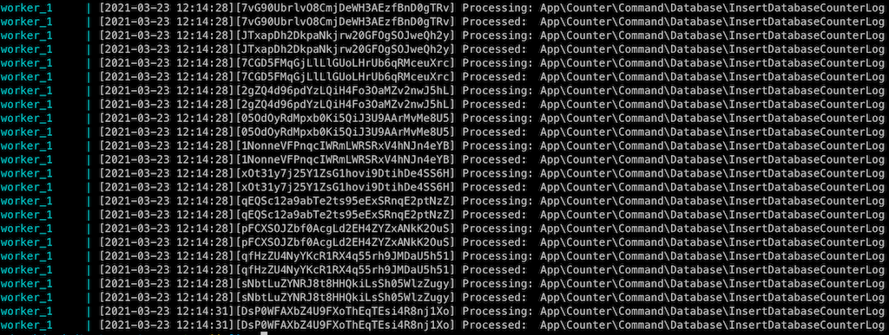

    - To confirm further, check data inserted by the queue by login to **mysql** service and run this query `select * from counter.counter_log;`

        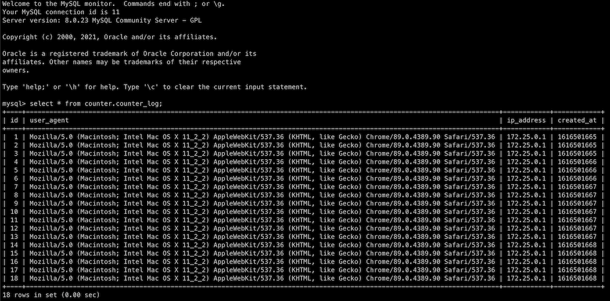

    - To confirm the scheduler is running correctly, visit `http://localhost:[DOCKER_COMPOSE_MAILHOG_HOST_PORT]`, there must be emails in the inbox every 5 minutes

        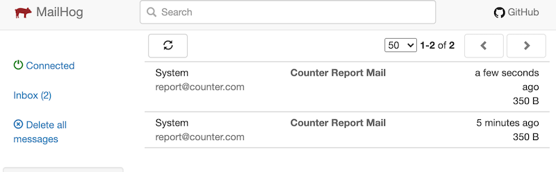

    - The file created by the application is belonged to the `DOCKER_COMPOSE_USER` and `DOCKER_COMPOSE_USER_GROUP`, in this example `DOCKER_COMPOSE_USER` is `501` and the command `ls -lah bootstrap/cache` is run inside **worker** service 

        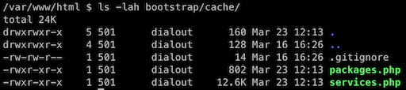

    - Any docker-compose command must **fail** if `DOCKER_COMPOSE_USER` or `DOCKER_COMPOSE_USER_GROUP` is not set  

3. Bash Tools
    - init
        - Start from scratch, clone the project into new folder
        - Set `.env.docker-compose` file
        - Execute `./infra init`
        - After all steps executed, all services and other `infra` commands must fully functional without any added manual step
    - up
        - All services are run in the background

            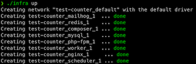

    - down
        - All resources are cleaned up

            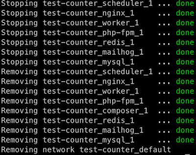

    - build
        - All services image are built successfully without any added manual step
        - If no service given `./infra build`, build all services
        - If single service or multiple services given `./infra nginx php-fpm`, only build the given service or services
    - logs
        - If no service given `./infra logs`, show logs from all services
        - If single service or multiple services given `./infra logs nginx php-fpm`, only show the logs for the given service or services

            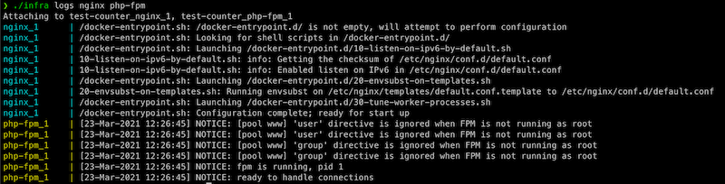
 
    - restart
        - If no service given `./infra restart`, restart all services
        - If single service or multiple services given `./infra restart nginx php-fpm`, only restart the given service or services

            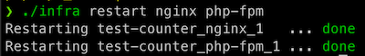

    - sh
        - Exec sh to the given service `./infra sh worker`
        - If no service given, print help

            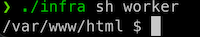

    - artisan
        - If no arguments given `./infra artisan`, the default for artisan command is print help
        - Try to execute with given arguments such as `./infra artisan migrate --seed`, migrate and seed command must be run

            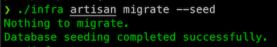

    - test
        - If no arguments given `./infra test`, the default for phpunit is run all testcase, all test case must be success
        - Try to execute with given arguments such as `./infra test tests/Unit/CacheCounterCommandQueryTest.php`, phpunit must only run the test case for given file

            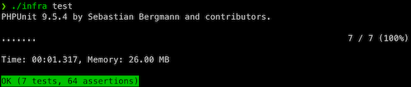

    - composer
        - If no arguments given `./infra composer`, the default composer command print the help
        - Try to execute with given arguments such as `./infra composer dump-autoload`, composer must run the given arguments
        - Any file generated by composer service must belong to the `DOCKER_COMPOSE_USER` and `DOCKER_COMPOSE_USER_GROUP`

            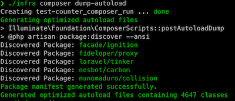

    - mysql
        - Login to the mysql as root and able to do query `./infra mysql`

            

    - redis
        - Login to the redis-cli and able to do query `./infra redis`

            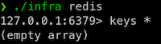

    - help
        - Print the help in color and use the same exact words

            

4. Release
    - Image size:

        Measured by `docker image ls` at `SIZE` column

        - `jakmall/recruitment/cloud-engineer/counter/nginx/release`: `23MB`
        - `jakmall/recruitment/cloud-engineer/counter/php-fpm/release`: `115MB`
        - `jakmall/recruitment/cloud-engineer/counter/php-cli/release`: `110MB`

    - Docker Compose
        - `./infra build` build the correct image based on the current environment
        - All local docker compose is fully functional with **release image**
        - Make sure **php-fpm** and **worker** service run as `www-data` user by checking the generated config cache file at `bootstrap/cache/config.php`

            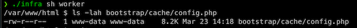

        - The volume is mapped at **php-fpm** and **worker** service when using **local environment**
        - The volume is not mapped at **php-fpm** and **worker** service when using **release environment**
        - There's no unneeded files inside **php-fpm** and **worker** container

            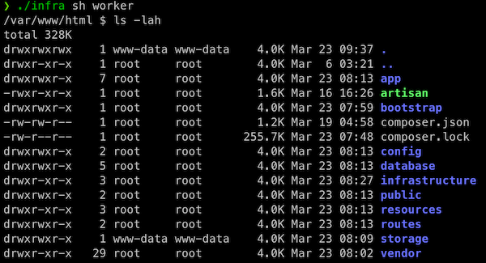

    - Bash Tools
        - Current environment is printed on help command
        - Able to switch environment smoothly between **local** and **release**

            

            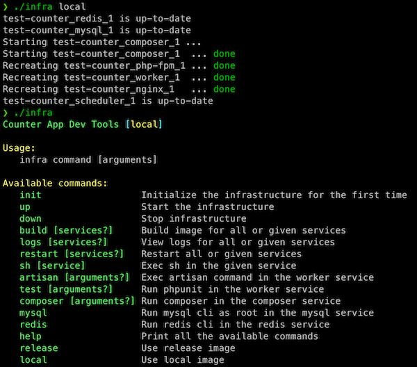

5. Readme

    Read the `README` you created and visualize you are a new engineer that just clone the project.

    Follow the steps described on the `README`, you must be able to set up functional environment with the given steps in the `README`.
